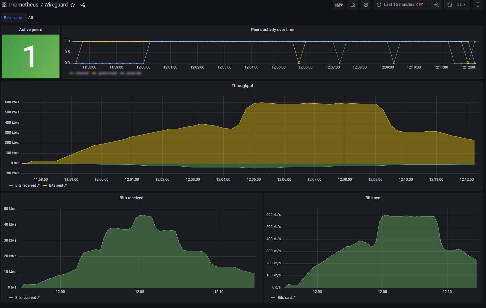

# Prometheus Wireguard Metrics Exporter
    

Prometheus Wireguard Metrics Exporter is a simple Python application that exports metrics from [Wireguard](https://github.com/WireGuard) to [Prometheus](https://prometheus.io/) format. This application uses the [Prometheus Python client library](https://github.com/prometheus/client_python) to generate metrics and the [FastAPI](https://fastapi.tiangolo.com/) framework to handle HTTP requests. This exporter can optionally use HTTPS for secure communication.

Metrics
-------

The exporter collects the following metrics using the `wg show all dump` command:

-   `wireguard_latest_handshake_timestamp`: The latest timestamp for a handshake with a Wireguard peer.

-   `wireguard_bits_received`: The number of bits received from a Wireguard peer.

-   `wireguard_bits_sent`: The number of bits sent to a Wireguard peer.

-   `wireguard_peer_active`: Whether the Wireguard peer was active in the last 125 s.

All metrics have the following labels:

-   `interface`: The name of the Wireguard interface.

-   `public_key`: The public key of the Wireguard peer.

-   `endpoint`: The endpoint (IP address and port) of the Wireguard peer.

-   `allowed_ips`: The allowed IP addresses for the Wireguard peer.

-   `name`: Peer name by public key in the configuration file.

## Installation

To install Prometheus WireGuard Metrics Exporter you need to perform the following steps:

      `git clone https://github.com/mirekdusin/prometheus-wireguard-exporter.git /opt/wireguard-exporter`

## Usage

You can run WireGuard Metrics Exporter by executing the `src/main.py` file:

      `sudo python3 src/main.py [--ip <IP>] [--port <port>] [--wg <path/to/wg>] [--tls-cert <path/to/cert.pem>] [--tls-key <path/to/key.pem>]`

The available options are:

-   `--ip:` The IP address to bind the app to. The default is <b>localhost</b>.

-   `--port:` The port on which to listen for requests. The default is <b>9820</b>.

-   `--wg:` The path to the wg. The default is <b>/usr/bin/wg</b>.

-   `--tls-cert:` The path to the TLS certificate file, if you want to use HTTPS.

-   `--tls-key:` The path to the TLS private key file, if you want to use HTTPS.

After the exporter is running, you can scrape the metrics from the /metrics endpoint using a Prometheus server.

## Testing

You can test exporter like this: 

`curl http://localhost:9820/metrics`

## Running as a Systemd Service

To run `wireguard-exporter` as a systemd service, you can use the `install/install.sh` script provided in the repository. The script installs the necessary dependencies,, sets up the systemd unit file and reloads the systemd daemon.

To use the script, run the following command as root:

        `sudo chmod +x /opt/wireguard-exporter/install/install.sh && /opt/wireguard-exporter/install/install.sh`

## Adding the Exporter to Prometheus
To start scraping metrics from the exporter with Prometheus, you will need to add a scrape job to your Prometheus configuration file. Follow these steps to add the exporter to your scrape job:

      scrape_configs:
        - job_name: 'wireguard'
          static_configs:
            - targets: ['YOUR_WIREGUARD_IP:9820']
              labels: 'wireguard'
              
For security reasons, it's a good idea to configure your firewall so that only the Prometheus server can access the exporter metrics. You can do this by adding a rule to your firewall that only allows incoming traffic on port 9820 from the IP address of your Prometheus server. This will prevent others from accessing the exporter metrics.
              

## Grafana Dashboard
I've provided a sample Grafana dashboard that you can use to visualize the metrics exported by this exporter. The dashboard can be found in the [grafana/grafana.json](https://github.com/mirekdusin/Prometheus-Wireguard-Exporter/blob/master/grafana/grafana.json) file.

## License

This application is released under the MIT License.

## Acknowledgements

This application is inspired by the [prometheus_wireguard_exporter](https://github.com/MindFlavor/prometheus_wireguard_exporter) project by [MindFlavor](https://github.com/MindFlavor).
